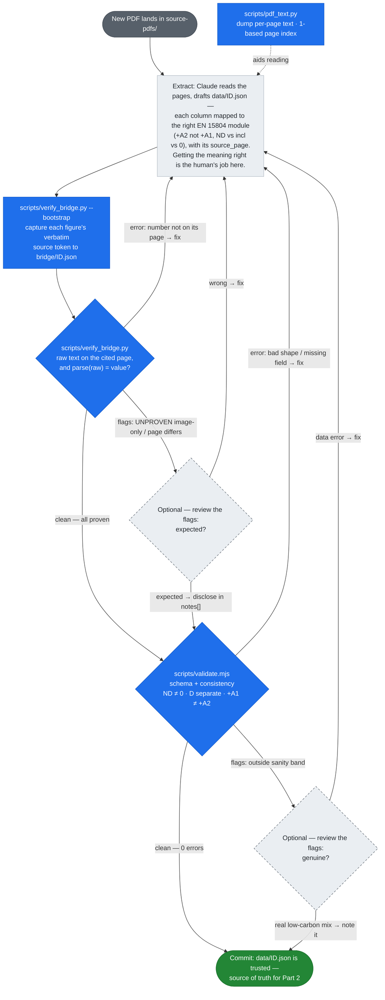

# Low Carbon Materials Hub — Assessment

A thin slice of a platform that makes concrete **EPDs** (Environmental Product Declarations) comparable for non-expert builders. Two parts, done in order:

- **Part 1 — data:** extract 20 concrete EPD PDFs into structured, provenance-traceable JSON.
- **Part 2 — app:** a Next.js + TypeScript app to compare products by embodied carbon across the life cycle.

**▶ Live app: https://lcmh-assessment-comparison.vercel.app/**

## Status

- **Part 1 — complete.** 20 EPDs → `data/*.json` (95 products, incl. one 76-mix catalog). See the [review](docs/reviews/2026-07-03-part1-extraction-review.md): hard rule holds, 0 wrong numbers.
- **Part 2 — built.** Next.js + TypeScript app in [`web/`](web): browse, per-product detail, and stage-by-stage compare, with a clickable source link on every figure. See the [Part 2 review](docs/reviews/2026-07-03-part2-app-review.md). Deployed: **[live app ↗](https://lcmh-assessment-comparison.vercel.app/)**.

## The one hard rule

Every carbon figure traces to its source EPD — `{ source.file, source_page }`. A number without provenance does not ship. The honesty invariants (not-declared ≠ zero, `incl` ≠ ND ≠ 0, module D kept separate, +A1 not comparable with +A2) are spelled out in [`CLAUDE.md`](CLAUDE.md) and encoded in the schema + validator.

## What's here

| Path | What |
|---|---|
| `data/*.json` | One record per EPD — the extracted data (source of truth for Part 2). |
| `data/schema.md` | The JSON schema (v1.3) and its rules. |
| `data/README.md` | Corpus overview + `epd_id` → source-PDF filename map. |
| `bridge/*.json` | Provenance bridge — each figure paired with its verbatim source token (the real ↔ transformed mirror). |
| `source-pdfs/` | The 20 source PDFs, committed — the provenance backbone. |
| `EXTRACTION.md` | How and why the extraction was done (the reasoning). |
| `scripts/validate.mjs` | Structural + consistency validator (Node). |
| `scripts/verify_bridge.py` | Provenance verifier — proves each figure's number is on its source page; builds/checks `bridge/` (Python). |
| `scripts/pdf_text.py` | Dumps per-page PDF text with 1-based page index (extraction tool). |
| `web/` | Part 2 — the Next.js + TypeScript app (browse · detail · compare). |
| `docs/` | Brainstorms, plans, and reviews. |

## From a new PDF to trusted data

What happens when a PDF lands in `source-pdfs/` — the path a record takes before it's allowed into `data/*.json`. The machine runs in a deliberate order — **provenance first (`verify_bridge.py`), then structure (`validate.mjs`)** — and each command hands its results straight to you. Getting the *meaning* right (right module, +A2 vs +A1, `ND` vs `incl` vs `0`) is the human's job while drafting, because a correctly-copied number in the **wrong module slot** passes every script. After that the human is **optional**: a clean file flows straight through untouched, and you're pulled in only when a command **flags** something — a flag isn't a failure, it's *look at this*. You triage it on the spot: **expected → disclose in `notes[]` and move on; genuinely wrong → fix and re-run**. (The runs above show exactly this: image-only tables surface as `UNPROVEN`, four low-carbon mixes fall outside the sanity band — all real, all already noted, and both scripts still end `0 errors`.)



**Legend** — blue = a script gate you run · **dashed grey = optional human triage** (only when that command flags something; a clean file skips it) · green = the trusted output. A flag → *note it and pass* or *fix and re-run*; a hard error always loops back. Because a fix re-enters at the bridge bootstrap, the source token is always re-captured — a stale bridge fails by design.

## Checking the data

Two checks, run **in this order — provenance first, then structure:**

```sh
python3 scripts/verify_bridge.py   # 1. are the numbers real?  (each figure is on its cited PDF page)
node    scripts/validate.mjs       # 2. is the record sound?   (structure + internal consistency)
```

**Why this order.** Provenance is the one hard rule ([`CLAUDE.md`](CLAUDE.md)): a number that isn't on its source page is worse than no number — someone makes a real procurement decision on it. `verify_bridge.py` is the *only* check that proves a figure actually appears in the PDF; `validate.mjs` merely confirms the record *claims* a page and is internally consistent. A structurally-perfect record can still cite a fabricated number — so prove the numbers are honest first, then check they're well-formed. (`verify_bridge.py` reads the bridge, so it's also the check that catches a stale or edited figure before you spend effort on structure.)

### 1. Verify provenance — the bridge (`verify_bridge.py`)

`verify_bridge.py` pairs every figure with the verbatim source token in `bridge/<epd_id>.json` (`{ "value": 36.1, "page": 8, "raw": "3.61E+01" }`) and checks `raw ⊂ page` and `parse(raw) == value`. Image-rendered results tables (no extractable text) surface as **UNPROVEN**, never a silent pass.

Needs **PyMuPDF** (`pip install pymupdf`):

```sh
python3 scripts/verify_bridge.py              # verify data ↔ bridge ↔ PDF (0 errors = all proven)
python3 scripts/verify_bridge.py --bootstrap  # regenerate bridge/ after editing data/*.json
python3 scripts/verify_bridge.py --selftest   # tokeniser/parse self-check
python3 scripts/pdf_text.py source-pdfs/<file>.pdf [page]   # dump per-page text (extraction tool)
```

**Edited a figure? Re-`--bootstrap`.** The bridge is captured once and cached; after changing any number in `data/*.json`, re-run `--bootstrap` to re-capture its source token — otherwise verify fails on a stale bridge (by design). These are local/CI checks and **not** part of the Vercel build (which is Node-only).

### 2. Validate structure (`validate.mjs`)

```sh
node scripts/validate.mjs
```

Needs **Node 18+** (pure builtins — no `npm install`). Exit 0 with **0 errors** = every record is structurally sound and every figure carries provenance. **Flags** are human-review items (e.g. an unusually low-carbon mix), not failures — each is explained in the record's `notes[]`.

## Part 2 — the app

A Next.js (App Router) + TypeScript app in [`web/`](web) that reads `../data/*.json` directly — **no database** (20 static files). It lets a non-expert builder:

- **Browse** all products, filtered by compressive strength and AU state. The 76-mix Hallett catalog collapses into one drill-in card so it doesn't bury the 19 distinct EPDs.
- **Compare** 2+ products side by side, **stage by stage** across the full life cycle (A1–A3 · A4 · A5 · B · C · D), via a shareable `/compare?ids=…` URL.
- **Inspect** one product in full at `/product/[id]` — declaration metadata, A1–A3 composition, and the extraction notes.

**Honesty is the point** (see [`CLAUDE.md`](CLAUDE.md)): not-declared renders as "Not declared", never `0`, and is never summed; module **D** is shown separately and never folded into an A–C total; `incl` sub-modules show as the combined A1–A3; +A1/CML figures are badged "not comparable" and never mixed with +A2; and **every figure deep-links to its source PDF page**.

### Run locally

```sh
cd web
npm install
npm run dev          # http://localhost:3000
```

`predev`/`prebuild` first run `scripts/validate.mjs` (the data must pass) and then copy `source-pdfs/` into `web/public/` so provenance links resolve. Needs **Node 20.9+** for the app; the `npm test` honesty self-check runs TypeScript directly, so use **Node 22.18+/24**.

### Deploy to Vercel

The app is in `web/` but reads `../data` and `../source-pdfs` at the repo root, so set:

- **Root Directory** = `web`
- **Include files outside the Root Directory in the Build Step** = **ON** (Vercel default) — makes `../data` (build-time imports) and `../source-pdfs` (copied into `public/`) available at build.

Framework preset = Next.js (auto-detected), no environment variables. Live: **https://lcmh-assessment-comparison.vercel.app/**
